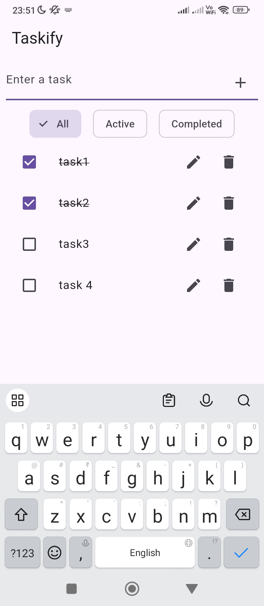
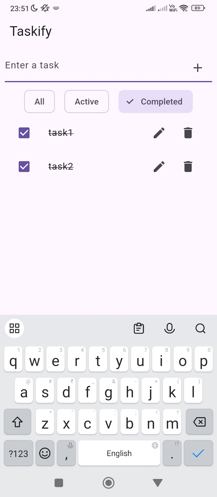
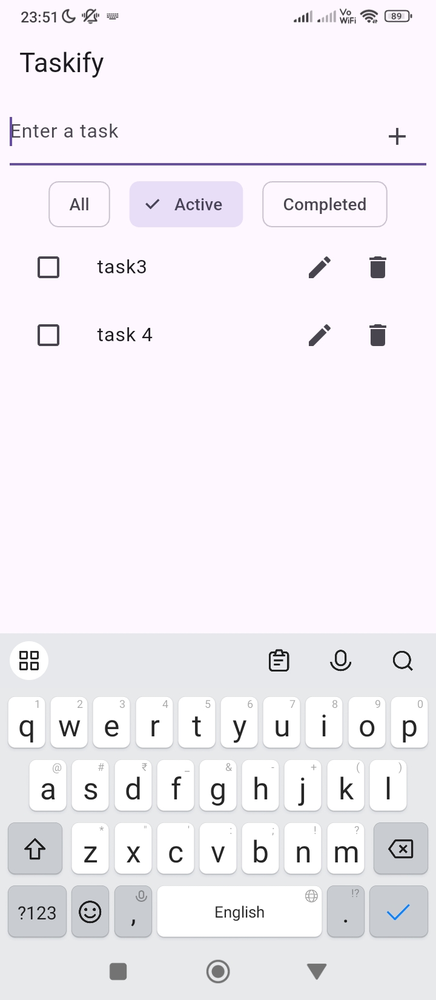

# flutter_project

A new Flutter project.

## Getting Started

This project is a starting point for a Flutter application.

A few resources to get you started if this is your first Flutter project:

- [Lab: Write your first Flutter app](https://docs.flutter.dev/get-started/codelab)
- [Cookbook: Useful Flutter samples](https://docs.flutter.dev/cookbook)

For help getting started with Flutter development, view the
[online documentation](https://docs.flutter.dev/), which offers tutorials,
samples, guidance on mobile development, and a full API reference.

APK :- https://drive.google.com/file/d/1a13sgtnmKAGzbW87p6mYKr-XyenNGqN6/view?usp=drive_link

## Screenshots

###  Task List


### Task List


### Task List



//-----------------------------------------------------------------------
# ✅ Taskify - To-Do Manager App

Taskify is a lightweight to-do manager app built using Flutter. It lets users manage tasks effectively with local data persistence using Hive and state management via GetX.

## Features

-  Add, edit, and delete tasks
-  Mark tasks as complete/incomplete
-  Filter by All / Active / Completed
- Persist tasks using Hive (No backend)
-  Reactive UI using GetX
-  Clean UI with Material Design

## Tech Stack

- **Flutter** & **Dart**
- **State Management**: GetX
- **Local Storage**: Hive
- **UI Toolkit**: Material Widgets

## 📦 APK Download

APK :- https://drive.google.com/file/d/1a13sgtnmKAGzbW87p6mYKr-XyenNGqN6/view?usp=drive_link

##  Getting Started

```bash
git clone https://github.com/SwetaSays/taskify-.git
cd taskify-
flutter pub get
flutter packages pub run build_runner build  
flutter run
